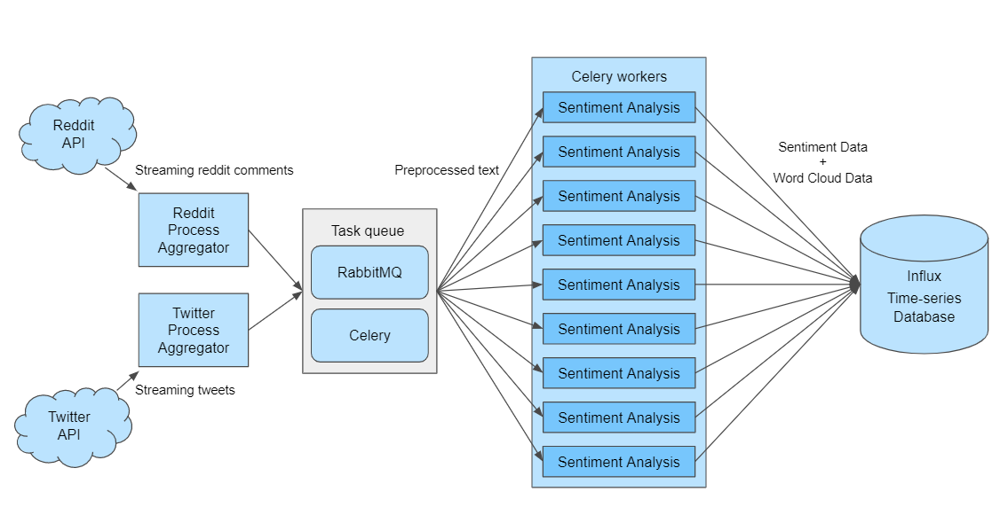

# Stock Sentiment Tracker

Stock Sentiment Tracker is an innovative platform for monitoring the current market sentiments regarding the top twenty five stocks in the Dow Jones Industrial Average (DJIA) index. This is done through real time sentiment analysis of textual information from social media sites like Twitter and Reddit.

## Rationale behind the project
Stock Market sentiment refers to the overall attitude of investors towards a particular security or financial market. It is the feeling of a market or its crowd psychology, as revealed through the activity and price movement of the market. Stock prices are hard  to predict because of their highly volatile nature which depends on diverse political and economic factors, investor sentiment, and many other factors. Market sentiment is a qualitative measure of the attitude and mood of investors to financial markets in general, and specific sectors or assets in particular. Positive and negative sentiment drive price action, and also create trading and investment opportunities for active traders and long-term investors.

Analyzing stock prices based on either historical data or textual information alone has proven to be insufficient. Sentiments have turned out to be a significant influence on the movement of the stock market and social media as a powerful resource for market predictions.

Sentiment analysis is an interesting branch of Natural Language Processing (NLP), which is used to rate the language used in a body of text at various levels using algorithms, deep learning etc, but the accuracy obtained is limited. The aim of this project is to build a stock sentiment tracking platform that utilizes textual informatiom from multiple sources (i.e Twitter and Reddit) to analyze sentiment regarding the top twenty five DJIA stocks. 

## Novelties of the project

- **Live insights into the sentiment of the stock market:** The sentiment of the stock market can change rapidly in relation with breaking news and information. With sentiment analysis on textual information from social media, one can quickly visualize the changing sentiments of the stock market and make appropriate portfolio decisons. 

- **Multiple Streams of Data:** The platform processes mutiple streams of data from social media sites like Twitter and Reddit in real time to improve the accuracy of sentiment analysis.

- **Capturing Key markers using NLP:** NLP techniques like Tag Clouds/Word Clouds can provide deeper insights into the sentiment surrounding a stock. 

## Architecture

The proposed system uses real time streaming data from two data sources (Twitter and Reddit) for sentiment analysis.
- The data is first pre-processed and sent to a sentiment analysis module through a task queue.
- The sentiment analysis module applies NLP and sentiment analysis to extract information from the data and stores it in the Influx time-series database.
- This database can then be used by the API to fetch relevant data from the database to send to the front end.
- The frontend then visualizes the data in various ways to provide knowledge to the user.

The system can be divided logically into two modules: Data Ingestion and Data Representation.

### Data Ingestion Architecture

The data ingestion module is composed of Aggregators, Message Queue, Distributed Task Manager, Sentiment Analysis Workers.
- **Aggregators**: Aggregators are components that aggregate data from their corresponding sources i.e Twitter and Reddit. This data is then sent to sentiment analysis workers using a message queue.
- **Message Queue**: RabbitMQ is used by Celery to facilitate communication between the aggregators and sentiment analysis workers
- **Distributed Task Manager**: Celery acts as a distributed task manager and manages the sentiment analysis workers and communication with them. Workers are spun up and spun down depending on the quantity of data received from aggregators.
- **Sentiment Analysis Workers**: Sentiment analysis workers are components which do preprocessing and sentiment analysis on text received from aggregators.

### Data Representation Architecture

The data representation module is composed of API, Frontend UI, Stock data API.
- **API**: The API uses FastAPI for routing, validation etc .and Flux queries for querying and analyzing the data.
- **Frontend UI**: The frontend UI utilizes the axios library to communicate with the backend api and stock data api. React is used to declaratively build the UI while Chart.js performs visualizations to present the data in a meaningful manner
- **Stock data API**: Yahoo! Finance stock data api is queried to show the price information about various stocks.